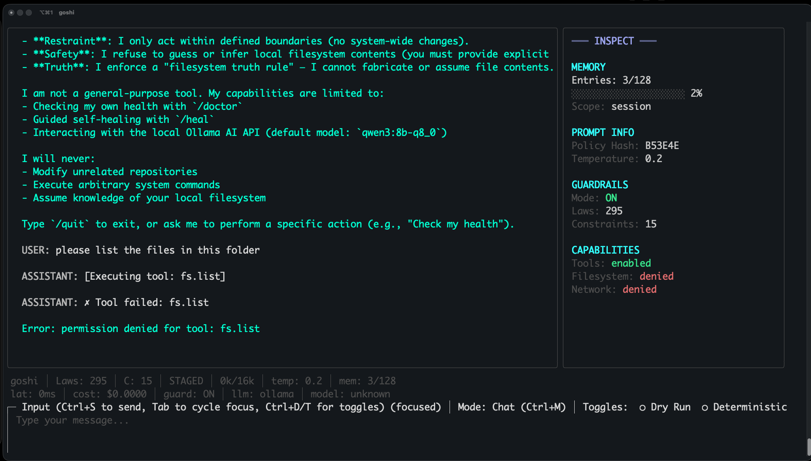
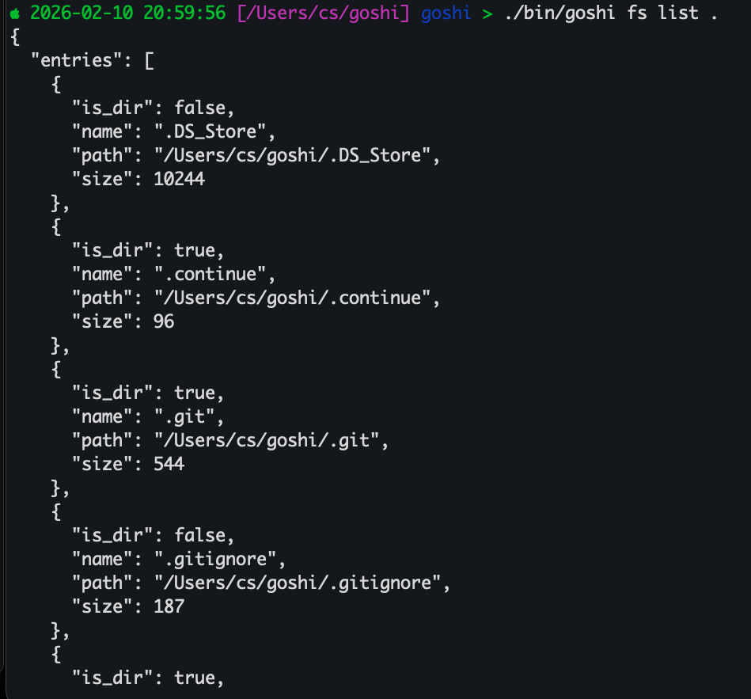

# goshi: Self-Aware AI-Assisted CLI Tool

**goshi** is a Go-based CLI tool and the self-hosted, self-aware successor to grok-cli.

Its primary goal is to be **safe, diagnosable, auditable, and self-healing — for itself only**.

This project explores a constrained, local-first model of AI-assisted tooling where **no action is implicit and no mutation is silent**.

Most documentation lives in the docs/ directory. README stays at the repo root so GitHub renders it on the main project page.

<details>
<summary>Table of Contents</summary>

- [Interactive Modes](#interactive-modes)
  - [TUI Mode (Default)](#tui-mode-default)
  - [Headless/CLI Mode](#headlesscli-mode)
- [Purpose](#purpose)
- [Core Concepts](#core-concepts)
  - [Human Context](#human-context)
  - [Self Model](#self-model)
  - [Diagnostics-First Execution](#diagnostics-first-execution)
- [LLM Integration Architecture](#llm-integration-architecture)
- [Filesystem Safety Model](#filesystem-safety-model)
- [Execution Pipeline](#execution-pipeline)
- [LLM Provider Configuration](#llm-provider-configuration)
- [Audit Logs](#audit-logs)
- [Testing](#testing)
- [GitHub Install (Quick Clone)](#github-install-quick-clone)
- [Build & Run](#build--run)
- [License](#license)

</details>

---

## Interactive Modes

goshi offers two modes of interaction:

### TUI Mode (Default)

Run `goshi` or `goshi chat` to launch an interactive Text User Interface:

```bash
./goshi
```

**Layout (v2.0):**
- **Left Region (70%)** — Output stream with message history
- **Right Region (30%)** — Inspect panel with 4 sections:
  - **Memory** — Entry count, usage bar, scope
  - **Prompt Info** — Policy hash, temperature
  - **Guardrails** — Mode (ON/OFF), law/constraint counts
  - **Capabilities** — Tools, filesystem, network permissions
- **Status Bar (2 lines)** — Telemetry: latency, tokens, cost, memory, guardrails, LLM model
- **Input Area** — Message composer with mode and toggles display


**Text User Interface**


**Command Line Interface running filesystem list in current folder**



**Features:**
- Real-time LLM streaming with visual feedback
- Scrollable message history (viewport with Up/Down arrows)
- Role-identified messages (USER: / ASSISTANT: / SYSTEM: / TOOL:) in distinct colors
- Tool execution with status indicators (✓ success, ✗ error)
- Collapsible code blocks (auto-collapse if >5 lines)
- Law metrics displayed in status bar
- Multi-line input with mode/toggle indicators

**Keyboard Controls:**
- **Navigation**
  - `Tab` / `Shift+Tab` — Cycle focus (output → inspect panel → input)
  - `↑/↓` or `PgUp/PgDn` — Scroll focused region
- **Actions**
  - `Ctrl+S` or `Enter` — Send message
  - `Ctrl+M` — Cycle mode (Chat → Command → Diff)
  - `Ctrl+D` — Toggle Dry Run
  - `Ctrl+T` — Toggle Deterministic
  - `Ctrl+C` or `Esc` — Quit
- **Message Modes**
  - **Chat** — Conversational interaction
  - **Command** — Imperative task execution
  - **Diff** — Comparison/analysis mode

**Execution Modifiers:**
- **Dry Run** — Preview execution without making changes (✓ on / ○ off)
- **Deterministic** — Reproducible output, no random choices (✓ on / ○ off)

**Status Indicators:**
- `●` — Waiting for LLM response
- `▊` — Streaming in progress
- `✓` — Tool executed successfully
- `✗` — Tool execution failed
- `(focused)` — Currently focused region

**Accessibility:**
- Full keyboard-only operation
- Screen reader compatible
- Role descriptions in natural language
- Focus indicators on all regions
- All shortcuts documented in TUI

### Headless/CLI Mode

For scripts, automation, or traditional stdio interactions, use the `--headless` flag:

```bash
./goshi chat --headless
```

This mode provides:
- Traditional stdin/stdout interaction
- No terminal UI requirements
- Suitable for piping and scripting
- Same tool-calling and permission model

---

## Purpose

goshi explores a stricter model of AI-assisted automation where:

- The tool has an explicit, machine-enforced understanding of what it is
- Safety invariants are checked before *any* action
- Filesystem mutation is gated behind explicit, auditable proposals
- Self-healing is constrained strictly to the tool’s own repository
- Diagnostics and decisions are deterministic and inspectable

This is an experiment in **bounded autonomy**, not a general-purpose AI agent.

---

## Core Concepts

### Human Context

Declares intent and purpose.

File:
- `goshi.human.context.yaml`

---

### Self Model

Defines machine-enforced identity, scope, and safety constraints.

File:
- `goshi.self.model.yaml`

The self model is treated as **authoritative** and violations are considered safety breaches.

---

### Diagnostics-First Execution

All actions are gated by diagnostic stages, executed in order:

1. Safety invariants
2. Self-model compliance
3. Environment checks

If any stage fails, execution halts.

---

## LLM Integration Architecture

goshi integrates LLMs as tool-calling assistants with strict permission boundaries and comprehensive audit trails. The integration is designed to be deterministic, inspectable, and reversible.

### Core Components

**Structured Message Types** — Type-safe message protocol between CLI and LLM:
- `UserMessage`: User input to the chat
- `AssistantTextMessage`: LLM text response
- `AssistantActionMessage`: LLM tool call request
- `ToolResultMessage`: Result from executing a tool
- `SystemPrompt`: System instructions for the LLM

All messages are converted to a unified JSON schema for transmission and persistence.

**Tool Registry** — Dynamic discovery and validation of available tools:
- Each tool has a unique identifier (e.g., `fs.read`, `fs.write`, `fs.list`)
- Tools include JSON Schema for argument validation
- Registry is built from the action dispatcher
- Tools are discoverable and help can be generated automatically

**Permission Model** — Fine-grained capability-based access control:
- Tools are gated behind explicit capabilities (`FS_READ`, `FS_WRITE`)
- Permissions are granted interactively during chat
- All permission decisions are logged with timestamps
- Denied permission attempts are recorded in the audit trail
- Capabilities persist for the duration of a chat session

**Audit Trail** — Complete record of all security-relevant events:
- Permission grants and denials
- Tool execution requests (granted and denied)
- Schema validation failures
- Timestamps and working directory context
- Retrievable in human-readable format via `session.GetAuditLog()`

### Six-Step Chat Flow

The chat loop implements a strict execution pipeline:

1. **Listen** — Accept user input and add to message history
2. **Detect Intent** — Parse LLM response for text vs tool call
3. **Plan** — Determine if tool execution is appropriate
4. **Parse** — Validate tool arguments against schema
5. **Act** — Execute tool or deny with permission error
6. **Report** — Add tool result to message history

Each step is independent and can be inspected. Steps 4-6 require explicit tool routing through permission checks.

### Chat Session Management

A `ChatSession` encapsulates one chat interaction:
- Maintains structured message history
- Manages permission state (initially no capabilities)
- Provides tool routing with permission enforcement
- Generates audit trails
- Handles conversion to legacy message formats for LLM compatibility

Chat sessions are created with an explicit system prompt and LLM backend:

```go
session, err := cli.NewChatSession(ctx, "You are a helpful assistant.", backend)
if err != nil {
    return err
}

// Grant permission for reads
session.GrantPermission("FS_READ")

// Add user message
session.AddUserMessage("List the files in the current directory")

// Execute tool (permission checked internally)
result := session.ToolRouter.Handle(app.ToolCall{
    Name: "fs.list",
    Args: map[string]any{"path": "."},
})

// Result is added to message history automatically
session.AddToolResultMessage("fs.list", result)
```

### Tool Execution & Validation

Tools are executed through a strict validation pipeline:

1. **Tool Existence Check** — Verify tool exists in registry
2. **Permission Check** — Verify capability is granted
3. **Schema Validation** — Validate arguments match declared schema
4. **Execution** — Run the tool and return result or error
5. **Audit Logging** — Record the attempt and result

The router returns typed results compatible with both legacy and structured workflows.

### Structured Response Parsing

The LLM's response is parsed into a deterministic structure:

```json
{
  "type": "action",
  "action": {
    "tool": "fs.read",
    "args": {"path": "file.txt"}
  }
}
```

Or for text responses:

```json
{
  "type": "text",
  "text": "Here is the information you requested..."
}
```

The parser is conservative and falls back to text mode if JSON parsing fails. Tool pattern detection works on common patterns but is not required.

---

## Filesystem Safety Model

goshi uses a **two-step, proposal-based filesystem model**.

### Key Properties

- **No filesystem mutation happens immediately**
- All writes are first recorded as proposals
- Proposals are persisted and auditable
- Applying a proposal requires explicit confirmation
- Dry-run is enabled by default

---

### Write Proposals

Creating a write **does not modify the filesystem**.

```bash
echo "NEW CONTENT" | goshi fs write path/to/file.txt
```

---

### Applying a Proposal

Applying a proposal **requires two explicit opt-ins**:

```bash
goshi fs apply <proposal-id> --yes --dry-run=false
```

---

### Drift Protection

If the target file has changed since the proposal was created, apply will fail.

---

## Execution Pipeline

goshi follows a deterministic, auditable pipeline:

1. **Detect** — Scan environment for binaries, configuration issues, and safety concerns
2. **Diagnose** — Analyze detected issues and assign severity levels  
3. **Repair** — Plan corrective actions 
4. **Execute** — Apply actions (dry-run by default)
5. **Verify** — Confirm repairs were successful

Each step is independent, deterministic, and inspectable.

---

## LLM Provider Configuration

goshi supports multiple LLM backends with a local-first philosophy.

### Ollama (Default — Local)

Ollama is the default provider, running models entirely on your machine:

```bash
# Install Ollama (https://ollama.ai)
ollama pull qwen3:8b-q8_0

# Run goshi (auto-detects Ollama)
./goshi chat
```

**Configuration** (`goshi.yaml`):
```yaml
llm:
  provider: ollama  # or "auto" to auto-detect
  model: qwen3:8b-q8_0
  temperature: 0
  local:
    url: http://localhost
    port: 11434
```

### OpenAI (Cloud Alternative)

For cloud-based models, goshi supports OpenAI's API:

**Setup:**

1. Get an API key from https://platform.openai.com/api-keys
2. Set the environment variable:
   ```bash
   export OPENAI_API_KEY='sk-...'
   ```

3. Configure the provider:
   ```yaml
   llm:
     provider: openai
     model: gpt-4o          # or gpt-4o-mini, gpt-4-turbo
     temperature: 0
   ```

4. Run goshi:
   ```bash
   ./goshi chat
   ```

**Supported Models:**
- `gpt-4o` — Latest GPT-4 Omni (recommended)
- `gpt-4o-mini` — Faster, more cost-effective
- `gpt-4-turbo` — Previous generation GPT-4
- `gpt-3.5-turbo` — Legacy model (not recommended for tool calling)

**Important Notes:**
- OpenAI requires internet connectivity
- API usage incurs costs (see https://openai.com/pricing)
- Token usage is logged to stderr for visibility
- Goshi maintains its local-first philosophy: Ollama is always preferred in auto-detect
- OpenAI backend uses the same tool-calling protocol as Ollama
- All safety invariants and permission checks apply equally

**Environment Variables:**
```bash
# Required
export OPENAI_API_KEY='your-api-key-here'

# Optional (for organization accounts)
export OPENAI_ORG_ID='org-...'
```

**Provider Selection:**
```bash
# Explicit provider via config
vim goshi.yaml  # Set provider: openai

# Or via environment variable
export GOSHI_LLM_PROVIDER=openai
./goshi chat

# Auto-detect (prefers Ollama if available)
export GOSHI_LLM_PROVIDER=auto
./goshi chat
```

### Backend Comparison

| Feature | Ollama | OpenAI |
|---------|--------|--------|
| **Privacy** | ✅ Fully local | ❌ Cloud-based |
| **Cost** | ✅ Free | ❌ Pay per token |
| **Internet Required** | ❌ No | ✅ Yes |
| **Setup Complexity** | Medium (install + pull models) | Low (just API key) |
| **Model Selection** | Any Ollama-compatible model | OpenAI models only |
| **Streaming** | ✅ Yes | ✅ Yes |
| **Tool Calling** | ✅ Yes (prompt-based) | ✅ Yes |
| **Cost Monitoring** | N/A | ✅ Yes |
| **Circuit Breaker** | ❌ No | ✅ Yes |
| **Connection Pooling** | ✅ Yes | ✅ Yes |
| **Retry Logic** | ✅ Basic | ✅ Exponential backoff |

**OpenAI Optimization Features:**
- **Cost Tracking**: Per-model pricing, session limits, warning thresholds
- **Circuit Breaker**: Auto-recovery from failures, 3-state protection
- **Connection Pooling**: Shared HTTP client, keep-alive, configurable limits

For full LLM integration details, see [docs/LLM_INTEGRATION.md](docs/LLM_INTEGRATION.md).

---

## Audit Logs

goshi records permission decisions and tool activity into session-scoped audit logs on your local machine. Logs are JSONL files stored under `.goshi/audit/` (one file per session), designed to be human-readable and easy to export.

**Quick view:**
```bash
goshi audit
```

**Filter and export:**
```bash
goshi audit --since=1h --type=tool
goshi audit --format=json --limit=200
```

**Configuration highlights:**
- `audit.tool_arguments_style`: `full | long | short | summaries` (default: summaries)
- `audit.redact`: redact sensitive values in logs (default: true)
- `audit.retention_days` / `audit.max_sessions`: retention controls

Design notes and schema details: [docs/AUDIT_LOGS_DESIGN.md](docs/AUDIT_LOGS_DESIGN.md)

---

## Testing

goshi includes comprehensive test coverage for reliability and security across the system:

**Core Packages:**
- **Config** (51 tests): Configuration validation, environment variable handling, parameter bounds
- **Filesystem Safety** (13 tests): Path traversal protection, symlink handling, guard mechanisms
- **Protocol** (8 tests): Request parsing, manifest validation, JSON handling
- **Detection** (7 tests): Binary detection, PATH handling
- **Diagnosis** (6 tests): Issue creation, severity assignment
- **Execution** (9 tests): Dry-run vs actual execution, error handling
- **Verification** (8 tests): Pass/fail determination, failure reporting

**LLM Integration:**
- **Messages & Types** (7 tests): Structured message types, message conversion, validation
- **Tool Registry** (8 tests): Tool discovery, schema validation, registry population
- **Structured Parsing** (15 tests): JSON responses, tool pattern detection, error handling
- **Tool Router** (11 tests): Permission enforcement, tool dispatch, error responses
- **Permission Model** (8 tests): Permission grant/deny, audit logging, multi-capability
- **Chat Session** (5 tests): Session initialization, message history, permission state
- **Integration** (18 tests): End-to-end tool execution, permission enforcement, six-step flow validation

**TUI Integration (Bubble Tea):**
- **TUI Implementation** (9 tests): Model initialization, window resize, keyboard handling, message rendering
- **LLM Streaming Display** (3 tests): Response completion, progressive display, error recovery
- **Tool Execution UI** (2 tests): Tool result display, error handling, status indicators

**Total: 282 passing tests** across 16+ packages.

Run all tests:

```bash
go test ./internal/...
```

Run tests with coverage:

```bash
go test -cover ./internal/...
```

Run specific test package:

```bash
go test -v ./internal/cli/...
```

Run specific test function:

```bash
go test -run TestIntegration_FSReadTool ./internal/cli
```

---

## GitHub Install (Quick Clone)

Choose one of the following and paste it into your terminal:

**HTTPS**
```bash
git clone https://github.com/cshaiku/goshi.git
cd goshi
go mod download
make build
./goshi --help
```

**SSH**
```bash
git clone git@github.com:cshaiku/goshi.git
cd goshi
go mod download
make build
./goshi --help
```

**GitHub CLI**
```bash
gh repo clone cshaiku/goshi
cd goshi
go mod download
make build
./goshi --help
```

Want to contribute? Fork the repo on GitHub, then replace `cshaiku/goshi` with your fork URL.

---

## Build & Run

```bash
go build -o goshi
./goshi --help
```

Build with make:

```bash
make build
```

---

## License

MIT
